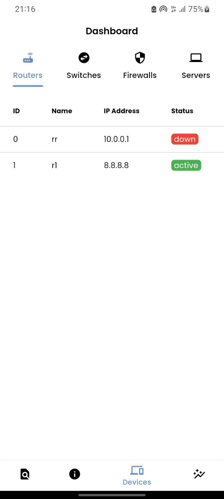
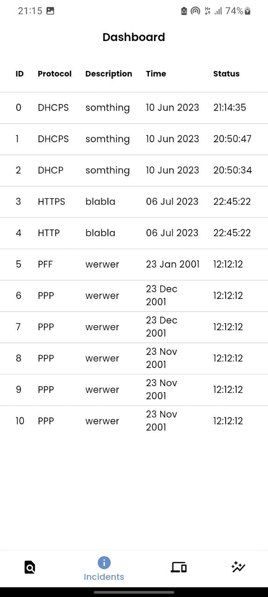
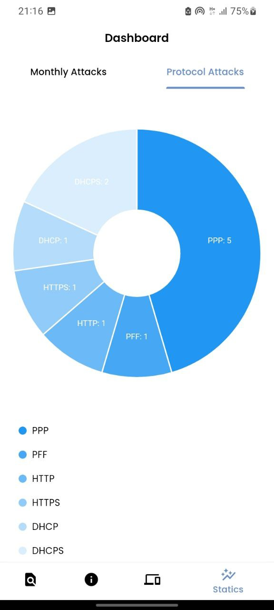
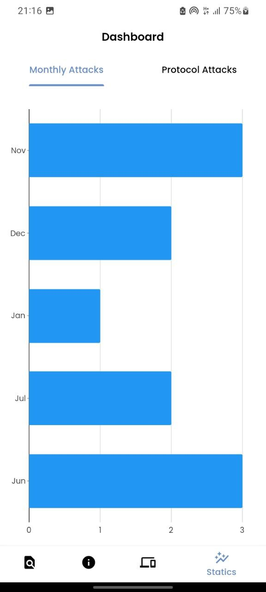
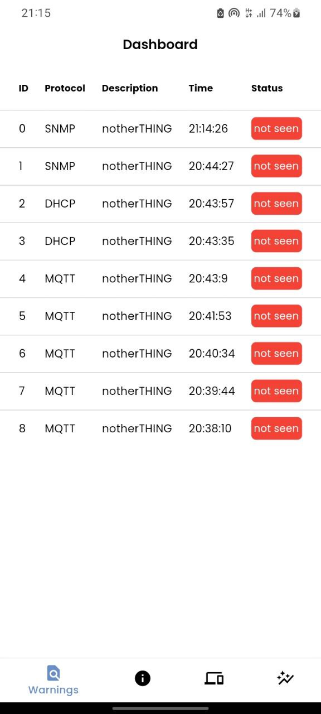

# SOAR Mobile

This Flutter app is a part from a whole ML-based system for network threats detection and response.
This mobile app allows the admin to monitor their network through visualisation of some stastics (Attacks per protocols...etc), and see the active/deactive devices in the network in real time using web sockets .

## Showcase

| Devices Status                           | Incident Table                           |
| ---------------------------------------- | ---------------------------------------- |
|  |  |

| Attacks per protocol                           | Attacks per month                           |
| ---------------------------------------------- | ------------------------------------------- |
|  |  |

| Warnings Table                           |
| ---------------------------------------- |
|  |
